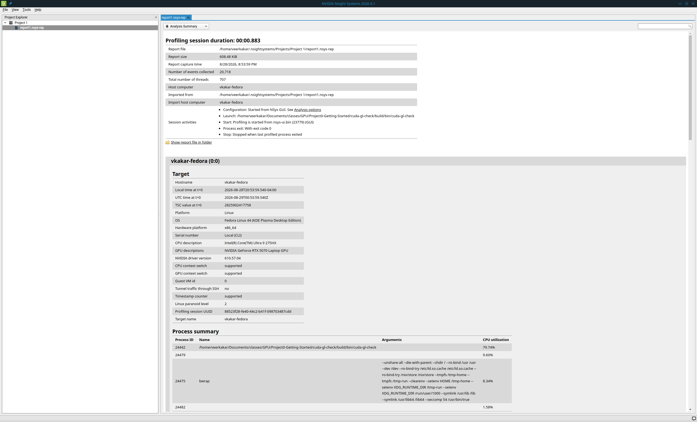
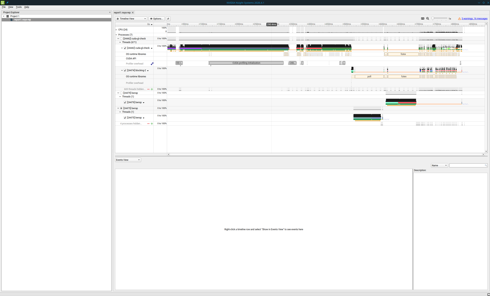
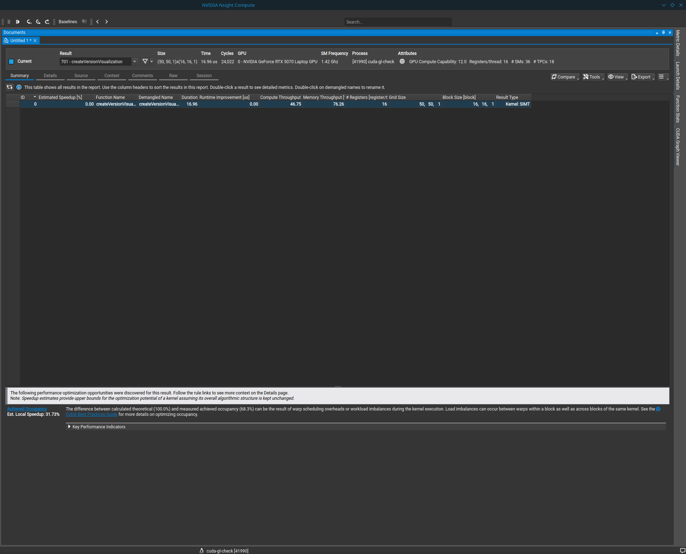
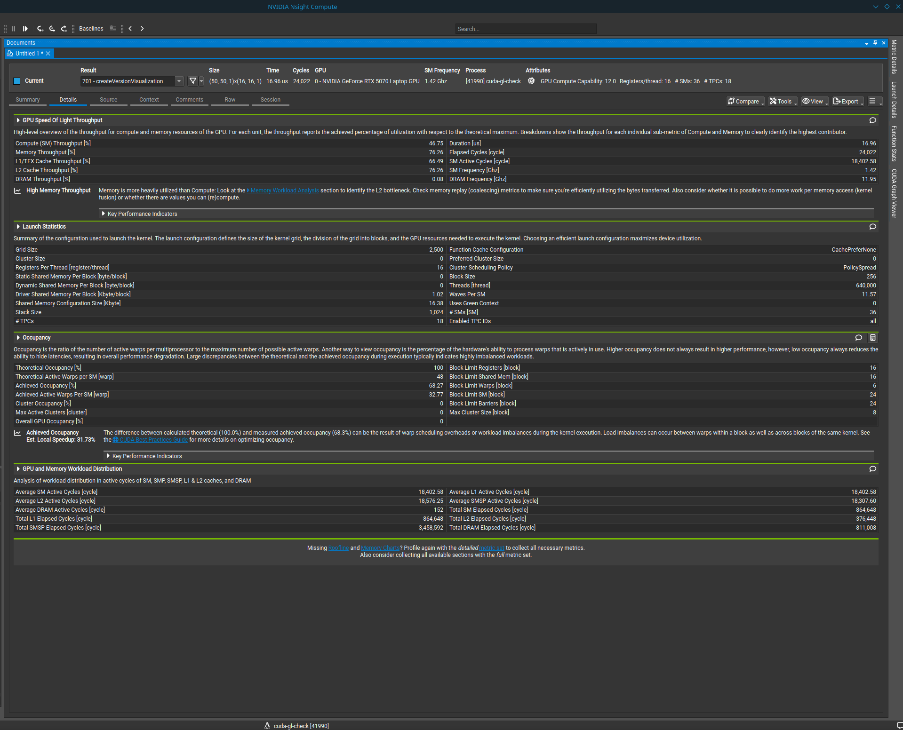
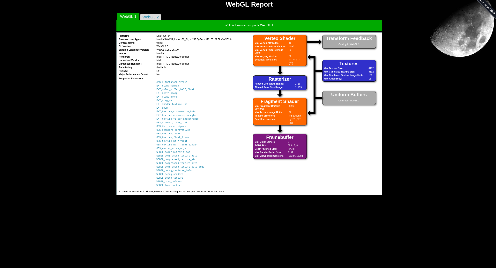
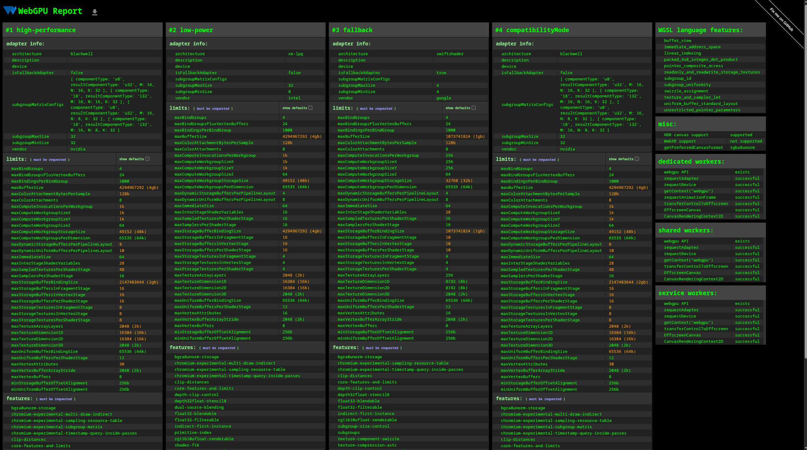

Project 0 Getting Started
====================

**University of Pennsylvania, CIS 5650: GPU Programming and Architecture, Project 0**

  Veer Kakar
  * [LinkedIn](www.linkedin.com/in/VeerKakar)
* Tested on: Linux Fedora 44 (Dual Boot from Windows Laptop), Intel Ultra 9 275HX, NVIDIA 5070

### Readme

